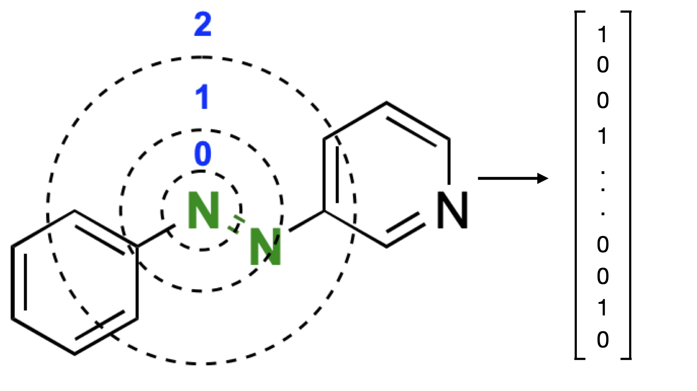
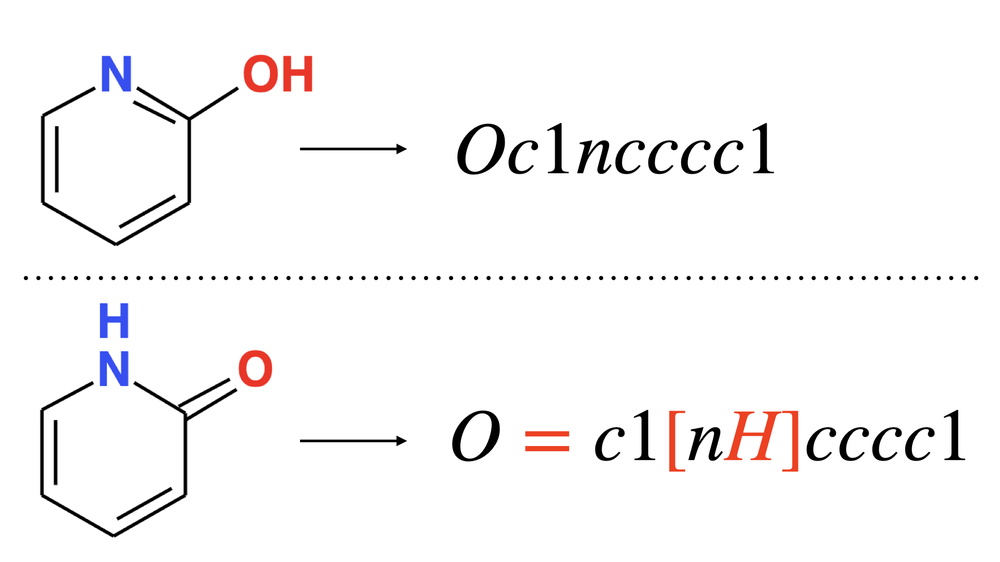
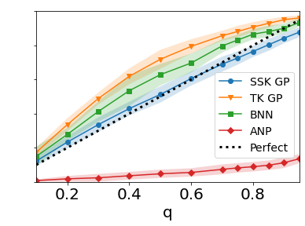

# FlowMO

[](LICENSE)

Library for training Gaussian Processes on Molecules

## Install

We recommend using a conda environment.

```
conda create -n gp_molecule python==3.7

conda install -c conda-forge rdkit
conda install matplotlib pytest scikit-learn pandas pytorch
pip install git+https://github.com/GPflow/GPflow.git@develop#egg=gpflow

cd Theano-master
python setup.py install
```

## Representations

The library currently supports SMILES and ECFP6 Fingerprints (pictured below)
as well as RDKit fragment features

<p align="center">
  
</p>

<p align="center">
  
</p>

## Uncertainty Calibration

An illustration of the uncertainty calibration of models: string kernel GP (SSK GP), 
Tanimoto GP (TK GP), Black Box Alpha Divergence Minimisation Bayesian Neural Network (BNN), 
Attentive Neural Process (ANP) on the Photoswitch Dataset.

<p align="center">
  
</p>

## Citing

If you find FlowMO useful for your research we would greatly appreciate if you would consider citing the following article!

```
@misc{moss2020gaussian,
      title={Gaussian Process Molecule Property Prediction with FlowMO}, 
      author={Henry B. Moss and Ryan-Rhys Griffiths},
      year={2020},
      eprint={2010.01118},
      archivePrefix={arXiv},
      primaryClass={cs.LG}
}
```
